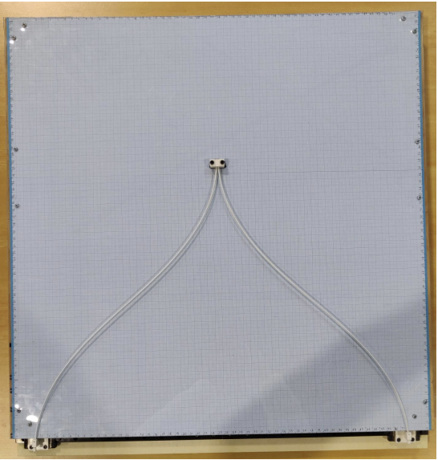
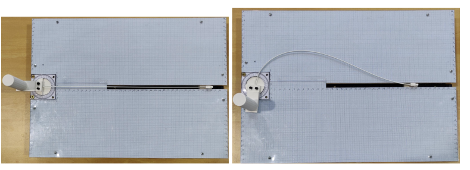

# Constrained-Elastic-System
In the third lab session of the SOROMO course, our focus was on the analysis of constrained elastic systems. The session involved the exploration of two distinct prototypes, each showcasing the intricate dynamics of soft robotics: the elastic slider-crank and a continuum parallel robot.

## Prototypes Overview
1. **Continuum Parallel Robot**  : A parallel architecture with closed kinematic chains.
2. **Elastic Slider-Crank**  : Featuring a rod between a revolute and a prismatic joint.

## Background
We improved our understanding of the modelization of Cosserat rods using the Shooting method and Strain-Based Parameterization (SBP), the current lab focused on the static modeling of parallel architectures with elastic components.

## Exploration Highlights

### 1. Methodology Insights
The initial section of the lab provided insights into the methodology for modeling intricate systems. This foundation laid the groundwork for subsequent case studies, emphasizing closed kinematic chains akin to real-world scenarios where closed hands form a parallel architecture with arms.

### 2. Numerical Simulations 
Section 2 delved into the development of numerical simulations for the two systems. This involved tasks related to the Shooting method and SBP, elevating our exploration to the static modeling of parallel architectures with elastic components.

### 3. Physical Prototypes 
In Section 3, we focused on the specifics of the physical prototypes used in the lab. Measurements of the real prototypes' behavior were taken, and a comprehensive comparison with our computed model was conducted.

## Conclusion
The lab exploration offered a deeper understanding of the challenges and intricacies involved in modeling constrained elastic systems. By combining theoretical insights with numerical simulations and real-world measurements, the session contributed to a holistic exploration of soft robotics, particularly in the context of parallel architectures.
